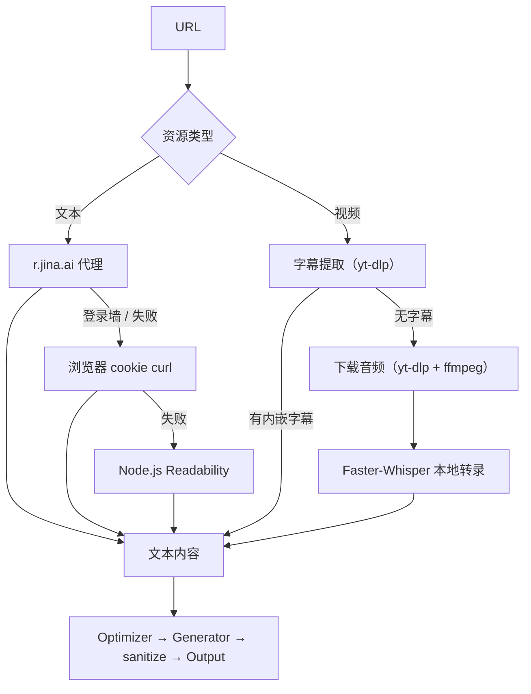
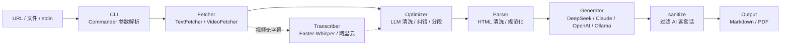

# AutoLearning

<p align="center">
  <b>从 URL 或本地文件，自动生成结构化 Markdown 学习笔记的 CLI 工具</b>
</p>

<p align="center">
  
  
  
</p>

## ✨ 功能亮点

- 📄 **文本 / 博客 / 专栏** —— 三级抓取降级（r.jina.ai → cookie curl → Readability），自动穿透登录墙
- 🎬 **视频** —— 内嵌字幕优先（秒级），无字幕自动降级本地 Faster-Whisper 转录（分钟级）
- 🧹 **内容清洗** —— LLM 去时间戳、纠错、去网页噪音、智能分段
- 🤖 **多 AI 后端** —— DeepSeek / Claude / OpenAI / Ollama，随时切换
- 📝 **双格式导出** —— Markdown / PDF，自动过滤 AI 客套话

---

## 🚀 快速开始

```bash
pnpm install && pnpm build
npm link                    # 注册 autolearn 全局命令

# 立刻试用
autolearn https://nodejs.org/en/about
autolearn -t video https://www.youtube.com/watch?v=dQw4w9WgXcQ&list=RDdQw4w9WgXcQ&start_radio=1
```

### 前置依赖

| 工具 | 何时需要 | 安装 |
|------|----------|------|
| yt-dlp + FFmpeg | 视频输入 | `pip install yt-dlp` / `apt install ffmpeg` |
| Python 3.10+ + faster-whisper | 视频无字幕时 | `uv pip install faster-whisper` |
| pandoc | `--format pdf` 导出 | `apt install pandoc` |

> 文本 / 博客输入零额外依赖。

---

## 📖 使用

### 文本（文档、博客、专栏）

```bash
autolearn https://nodejs.org/en/about                    # 普通网站（r.jina.ai 代理）
autolearn https://www.bilibili.com/opus/1042547317663596551  # Bilibili 专栏
autolearn --cookies-from-browser firefox "https://zhuanlan.zhihu.com/p/xxx"  # 知乎（需登录）
pbpaste | autolearn --stdin --title "标题"                # 手动输入
autolearn --file article.md                               # 本地文件
```

### 视频（YouTube、Bilibili）

```bash
autolearn -t video https://www.youtube.com/watch?v=xxx
autolearn -t video --cookies-from-browser firefox "https://www.bilibili.com/video/BVxxx"
autolearn https://www.youtube.com/watch?v=xxx             # auto 类型自动识别
```

### 通用选项

```bash
autolearn -p claude URL                # 指定 AI 提供商
autolearn -o ./my-notes URL            # 指定输出目录
autolearn --format pdf URL             # 导出 PDF
autolearn --force URL                  # 强制重新处理
autolearn --help                       # 完整帮助
```

---

## 🔍 工作原理



- **文本三级抓取**：r.jina.ai 代理（主）→ 浏览器 cookie curl（登录站点）→ Node.js Readability（兜底），自动检测登录墙并降级。
- **视频双路径**：优先提取内嵌字幕（秒级），无字幕时下载音频用本地 Faster-Whisper 转录（分钟级），含 VTT 滚动去重。
- **内容优化**：所有文本经 LLM 清洗（去时间戳、纠错、去网页噪音、智能分段），再生成笔记。
- **笔记风格**：TL;DR 开篇 → 段落/表格/引用自适应排版 → 关键洞察收尾，自动过滤 AI 客套话，末尾附源链接。

---

## ⚙️ 配置

`~/.autolearning/config.toml`：

```toml
[provider]
default = "deepseek"

[providers.deepseek]
api_key = "${DEEPSEEK_API_KEY}"
model = "deepseek-chat"
base_url = "https://api.deepseek.com/v1"

[providers.claude]
api_key = "${ANTHROPIC_API_KEY}"
model = "claude-sonnet-4-6-20250501"

[providers.openai]
api_key = "${OPENAI_API_KEY}"
model = "gpt-4o"

[providers.ollama]
base_url = "http://localhost:11434"
model = "llama3"

[output]
directory = "./notes"
filename_template = "{title}-{date}.md"

[local_whisper]
python_path = "/path/to/venv/bin/python3"
model_size = "base"          # tiny | base | small | medium | large
```

`${VAR}` 自动展开为环境变量。

---

## 🏗️ 架构



| 模块 | 路径 | 职责 |
|------|------|------|
| CLI | `src/cli.ts` | URL / `--file` / `--stdin` 三种输入，`--format pdf` 导出，`--force` 重跑，URL 历史去重 |
| Config | `src/config.ts` | TOML 配置 + `${ENV}` 展开 |
| Fetcher | `src/fetcher/` | TextFetcher（r.jina.ai → cookie curl → Readability 三级降级）+ VideoFetcher（字幕 → Whisper 双路径，VTT 去重） |
| Optimizer | `src/optimizer/` | LLM 清洗（去时间戳、纠错、去网页噪音、智能分段） |
| Parser | `src/parser/` | HTML 清洗、文本规范化 |
| Generator | `src/generator/` | LLM 生成笔记（DeepSeek / Claude / OpenAI / Ollama），自适应排版 prompt |
| Transcriber | `src/transcriber/` | 语音转文字（本地 Faster-Whisper / OpenAI Whisper API / 阿里云） |
| Output | `src/output/` | Markdown/PDF 写入 + AI 客套话过滤 |

---

## 🧪 开发

```bash
pnpm dev           # 开发运行（tsx）
pnpm build         # 构建
pnpm test          # 全部测试（52 个）
pnpm test:watch    # 监听模式
```
